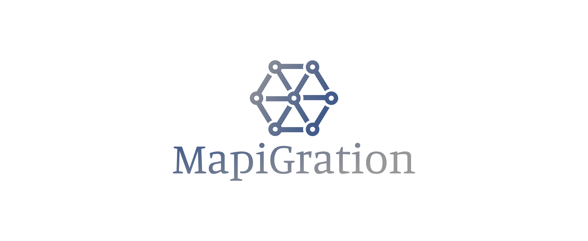

# logo.mapigration.com

+ [www.mapigration.com](https://www.mapigration.com/)
+ [docs.mapigration.com](https://docs.mapigration.com/)
+ [bash.mapigration.com](https://bash.mapigration.com/)
+ [examples.mapigration.com](https://examples.mapigration.com/)

        Font in use <a target="_blank" href="https://fonts.google.com/specimen/Manuale">manuale-regular</a> designed by
        <a target="_blank" href="http://www.omnibus-type.com/">Omnibus Type</a>
        and licensed under
        <a target="_blank" href="http://scripts.sil.org/cms/scripts/page.php?site_id=nrsi&amp;id=OFL_web">Open Font License.</a>
          Icon Designed by
          <a target="_blank" href="https://thenounproject.com/grega.cresnar">Gregor Cresnar</a>
          
          
          

## Font

    #425B8B, #999899

## Background
    
    transparent

## Icon

    #999899, #425B8B

## 1

## 2

## 3

## 4

---

+ [edit](https://github.com/mapigration/logo/edit/main/README.md)
+ [mapigration/logo/](https://github.com/mapigration/logo/)

          
